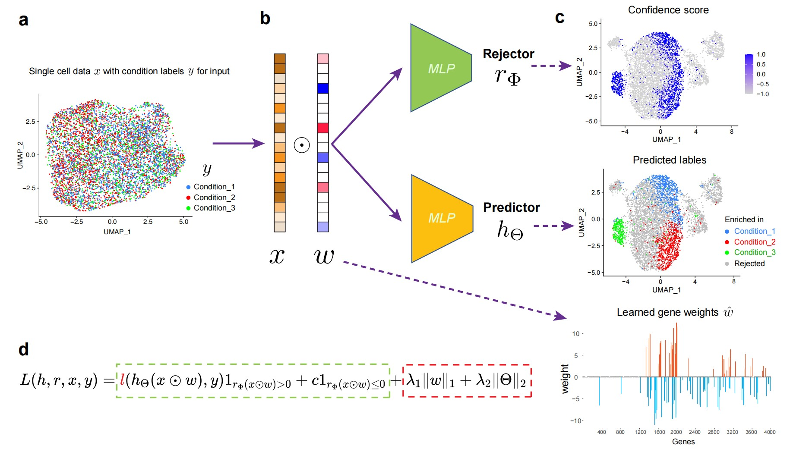

# PENCIL: Learning phenotype-enriched high confidence subpopulations from single-cell sequencing data

## What is it

PENCIL is a novel tool for single cell data analysis to identify phenotype enriched subpopulations and key marker genes simultaneously.

<p align="center">
  
</p>

## How to install
To build PENCIL, clone the repository:

    git clone https://github.com/Cliffthinker/PENCIL.git
    cd PENCIL

Then run

    pip install -e .

## Quick start in Python
```python
from pencil.pencil import *

# prepare data source
expression_data = np.random.rand(5000, 2000) # 5000 cells and 2000 genes.
phenotype_labels = np.random.randint(0, 3, 5000)
class_names = ['class_1', 'class_2', 'class_3']

# init a pencil model
model = Pencil(mode='multi-classification', select_genes=True)

# run
with mlflow.start_run():
    pred_labels, confidence = model.fit_transform(
      data, labels,
      class_names=class_names,
      plot_show=True
    )
    gene_weights = model.gene_weights(plot=True)
```

## Examples & Tutorials

## How to Cite PENCIL

## License


