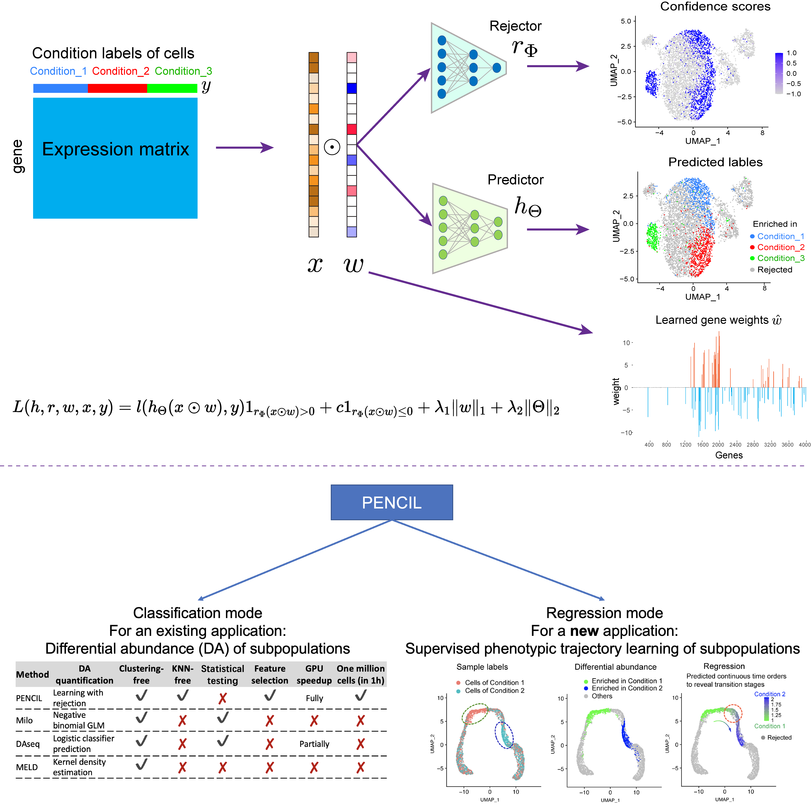

# PENCIL: Supervised learning of high-confidence phenotypic subpopulations from single-cell data

## What is it

PENCIL is a supervised learning framework to identify high-confidence phenotype-associated subpopulations from single-cell data (PENCIL). PENCIL is flexible to take either categorical phenotypes or continuous variables as inputs by changing the prediction function. By embedding a feature selection function into this flexible framework, PENCIL is able to select informative features and identify phenotypic cell subpopulations simultaneously. The workflow of PENCIL is depicted in the following figure:

<p align="center">
  
</p>

## News 
* Sep, 2022: PENCIL version 1.0.0 is launched.

## How to install
PENCIL is developed under Python(version >= 3.9). To build PENCIL, clone the repository:

    git clone https://github.com/cliffren/PENCIL.git
    cd PENCIL

Then install the PENCIL package by pip, and all requirements will be installed automatically.

    pip install -e .
You can also check `requirements.txt` to install the dependency packages manually, especially for the **GPU** version of pytorch, which is automatically installed for the CPU version.

## Quick start in python
```python
from pencil import *

# prepare data source
expression_data = np.random.rand(5000, 2000) # 5000 cells and 2000 genes.
phenotype_labels = np.random.randint(0, 3, 5000)
class_names = ['class_1', 'class_2', 'class_3']

# init a pencil model
model = Pencil(mode='multi-classification', select_genes=True, mlflow_record=True)

# run
with mlflow.start_run():
    pred_labels, confidence = model.fit_transform(
      expression_data, phenotype_labels,
      class_names=class_names,
      plot_show=True
    )
    gene_weights = model.gene_weights(plot=True)
```

## Examples & Tutorials
Using two examples with **categorical** or **continuous** phenotype labels, respectively, we demonstrate how to execute PENCIL. <br>

If you are used to working with the R, start here:
+ [PENCIL Tutorial in R](https://cliffren.github.io/PENCIL/examples/PENCIL_Tutorial_in_R.html)

If you also would like to use PENCIL in python, continue here:
+ [PENCIL Tutorial in Python](https://github.com/cliffren/PENCIL/blob/main/examples/PENCIL_Tutorial_in_Python.ipynb)


## How to Cite PENCIL
Please cite the following manuscript:
>Supervised learning of high-confidence phenotypic subpopulations from single-cell data. <br>
Tao Ren, Ling-Yun Wu and Zheng Xia


## License
PENCIL is licensed under the GNU General Public License v3.0. <br>
PENCIL will be updated frequently with new features and improvements. If you have any questions, please submit them on the [GitHub issues page](https://github.com/cliffren/PENCIL/issues).


