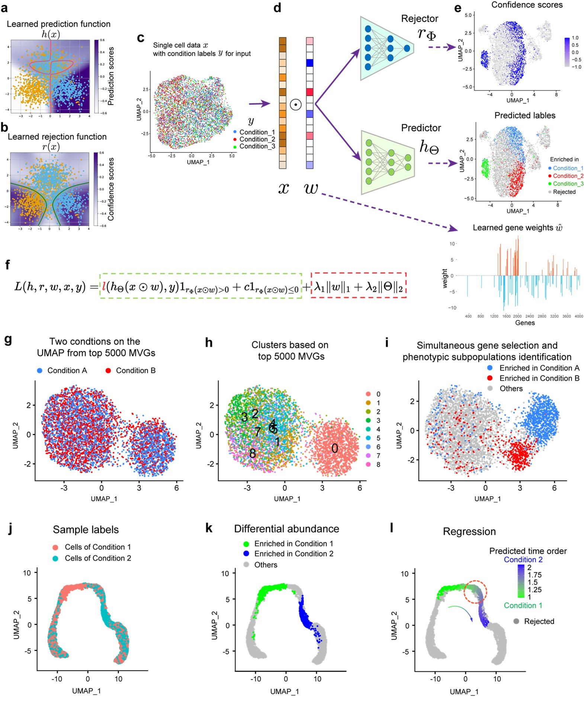

# PENCIL: Supervised learning of high-confidence phenotypic subpopulations from single-cell data

## What is it

PENCIL is a novel supervised learning framework to identify subpopulations associated with **categorical** or **continuous** phenotypes from single-cell data. Otherwise, by embedding a feature selection function into this flexible framework, PENCIL can also make it possible to **select informative features** and identify cell subpopulations simultaneously. 
The workflow of PENCIL is shown in the following figure:

<p align="center">
  
</p>

## How to install
PENCIL is developed under Python(version >= 3.9). To build PENCIL, clone the repository:

    git clone https://github.com/Cliffthinker/PENCIL.git
    cd PENCIL

Then install the PENCIL package py pip, and all requirements will be installed automatically.

    pip install -e .

## Quick start in python
```python
from pencil import *

# prepare data source
expression_data = np.random.rand(5000, 2000) # 5000 cells and 2000 genes.
phenotype_labels = np.random.randint(0, 3, 5000)
class_names = ['class_1', 'class_2', 'class_3']

# init a pencil model
model = Pencil(mode='multi-classification', select_genes=True, mlflow_record=True)

# run
with mlflow.start_run():
    pred_labels, confidence = model.fit_transform(
      dexpression_data, phenotype_labels,
      class_names=class_names,
      plot_show=True
    )
    gene_weights = model.gene_weights(plot=True)
```

## Examples & Tutorials


## How to Cite PENCIL
Please cite the following manuscript:
Supervised learning of high-confidence phenotypic subpopulations from single-cell data. 
Tao Ren, Canping Chen, Alexey V. Danilov, Shunyi Du, Xiangnan Guan, Xiwei Wu, Paul T. Spellman, Lisa M. Coussens, Andrew C. Adey, Gordon B. Mills, Ling-Yun Wu and Zheng Xia


## License
PENCIL is licensed under the GNU General Public License v3.0.
PENCIL will be updated frequently with new features and improvements. If you have any questions, kindly submit them on the GitHub issues page.


